# DoMINO-Automotive-Aero NIM Fine-tuning

## Overview

This example showcases a **fine-tuning recipe** for the **DoMINO-Automotive-Aero NIM**,
featuring an innovative **predictor-corrector approach** specifically designed for
automotive CFD simulations.

**Accelerated Training**: Dramatically reduce training time by leveraging pre-trained
models instead of starting from scratch

**Smart Transfer Learning**: Efficiently adapt powerful base models to new vehicle
configurations and boundary conditions

**Predictor-Corrector Approach**: An approach that combines the strengths of
pre-trained models with AI model based corrections

The predictor-corrector methodology is described below:

```bash
Y_finetuned = Y_predictor + Y_corrector
```

**The Components:**

- **Y_predictor**: Output from the pre-trained DoMINO-Automotive-Aero NIM (frozen weights)
- **Y_corrector**: A lightweight, trainable network that learns to correct prediction errors
- **Y_finetuned**: The final enhanced prediction combining both components

> **💡 Core Insight**: The predictor leverages extensive pre-training to provide robust
baseline predictions, while the corrector focuses on learning dataset-specific refinements.
This division of labor leads to faster convergence and superior performance compared to
training from scratch.

The finetuning example validated on the OSS DrivAerML dataset with only 16 training
and 8 testing samples. The results presented are preliminary and show encouraging
results. A thourough investigation is underway to provide more concrete datapoints
in terms of accuracy improvement and convergence acceleration.

### Key Features

- **Predictor-Corrector Approach**: Combines pre-trained models with learnable corrections
- **Transfer Learning**: Efficient adaptation to new vehicle configurations and boundary
conditions
- **DrivAerML Integration**: Seamless integration with the DrivAerML dataset
- **Modular Design**: Easy customization of both predictor and corrector models
- **High Performance**: Optimized for multi-GPU training and inference

### Architecture Components

| Component | Description | Training Mode |
|-----------|-------------|---------------|
| **Predictor** | Pre-trained DoMINO-Automotive-Aero NIM | Frozen (Evaluation Only) |
| **Corrector** | Custom DoMINO architecture | Trainable |
| **Combined** | Predictor + Corrector outputs | End-to-End Inference |

## Code Structure

```bash
domino_automotive_aero_nim_finetuning/
├── src/                           # Core Implementation
│   ├── conf/                      # Configuration Management
│   │   ├── config.yaml           # Main training configuration
│   │   └── config_base_pred.yaml # Base prediction settings
│   ├── model_base_predictor.py   # DoMINO predictor architecture
│   ├── train.py                  # Training pipeline
│   ├── test.py                   # Testing & inference pipeline
│   ├── generate_base_predictions.py # Base model predictions
│   ├── process_data.py           # Data preprocessing utilities
│   └── openfoam_datapipe.py      # VTK → NPY conversion
├── nim_checkpoint/               # Pre-trained Models
│   └── domino-drivesim-recent.pt # Pretrained model weights
├── download_dataset_huggingface.sh # Automated dataset download
└── README.md                     # This documentation
```

## Dataset & Model Setup

### DrivAerML Dataset

The **DrivAerML** dataset provides comprehensive automotive CFD simulations with
multiple vehicle configurations.
The dataset maybe found here: [DrivAerML Dataset](https://caemldatasets.org/drivaerml/)

| File Type | Description | Extension | Use Case |
|-----------|-------------|-----------|----------|
| **Geometry** | Vehicle STL meshes | `.stl` | 3D vehicle structure |
| **Volume Fields** | 3D flow field data | `.vtu` | Velocity, pressure, turbulence |
| **Surface Fields** | Vehicle surface data | `.vtp` | Wall pressure, shear stress |

### Dataset Download

```bash
# Download specific runs (e.g., runs 1-32)
./download_dataset_huggingface.sh -d ./drivaer_data -s 1 -e 32
```

### DoMINO-Automotive-Aero NIM Checkpoint

Download the DoMINO-Automotive-Aero NIM checkpoint from NGC and add it to the
checkpoint directory

**Source**: [Domino Checkpoint](https://catalog.ngc.nvidia.com/orgs/nim/teams/nvidia/models/domino-drivsim)

**Note**: Requires NGC API key for access. See [NGC documentation](https://docs.nvidia.com/ngc/)
for setup.

## Usage Guide

### Complete Fine-tuning Workflow

```mermaid
graph TD
    A[Download Dataset and pre-trained DoMINO NIM] --> B[Generate Base Predictions]
    B --> C[Process Data VTP → NPY]
    C --> D[Configure Training]
    D --> E[Train Corrector Model]
    E --> F[Test & Evaluate]
    F --> G[Deploy Fine-tuned Model]
```

<!-- markdownlint-disable -->
<div align="center">


</div>

### Step-by-Step Instructions

#### **Step 1: Generate Base Predictions**

Generate initial predictions using the pre-trained checkpoint. Modify the eval tab in
`config_base_pred.yaml` to specify the path to the downloaded checkpoint.

```bash
# Run predictor model on dataset
python src/generate_base_predictions.py

# Output: Predictions saved as VTP files with base model outputs
```

#### **Step 2: Data Processing (VTP → NPY)**

Convert VTP prediction files to efficient NPY format for training:

```bash
# Convert and preprocess data
python src/process_data.py

# Output: Training-ready NPY files with predictor outputs + ground truth
```

#### **Step 3: Train Corrector Model**

Train the corrector network to learn prediction refinements:

```bash
# Start training with default configuration
python src/train.py exp_tag=combined

# Custom configuration example
python src/train.py \
    exp_tag=1 \
    project.name=Dataset_Finetune \
    model.volume_points_sample=16384 \
    model.surface_points_sample=16384 \
    train.epochs=500
```

#### **Step 4: Test Fine-tuned Model**

Evaluate the combined predictor-corrector model:

```bash
# Run inference on test dataset
python src/test.py \
    exp_tag=1 \
    eval.checkpoint_name=DoMINO.0.500.pt \
    eval.save_path=/path/to/results \
    eval.test_path=/path/to/test_data
```

Output of the test script are final predictions combining predictor + corrector
written to a VTP/VTU file.

## Benchmarking results on DrivAerML dataset

The finetuning recipe is benchmarked for a subset of the DrivAerML dataset.
The finetuning is carried out on the first 24 samples from this dataset and
compared against training from scratch with the DoMINO model on the same dataset.
The DoMINO-Automotive-Aero NIM is trained on a dataset consisting of RANS
simulations, while this DrivAerML dataset consists of high-fidelity, time-averaged
LES simulations. The goal of this recipe is to demonstrate the finetuning of an
existing model checkpoint to a new design space and physics and compare it against
training from scratch.

Both models are evaluated at 50, 100, 200, 300, and 400 epochs to demonstrate
faster convergence of the finetuned model to an acceptable accuracy as compared
to training from scratch. 18 samples are used for training and 6 for validation.
The results averaged over the validation set are presented in the table below
and demonstrate that finetuning results in faster convergence (in fewer epochs)
of results as compared to training from scratch.

<!-- markdownlint-disable -->
<style type="text/css">
.tg  {border-collapse:collapse;border-spacing:0;}
.tg td{border-color:black;border-style:solid;border-width:1px;font-family:Arial, sans-serif;font-size:14px;
  overflow:hidden;padding:7px 16px;word-break:normal;}
.tg th{border-color:black;border-style:solid;border-width:1px;font-family:Arial, sans-serif;font-size:14px;
  font-weight:normal;overflow:hidden;padding:7px 16px;word-break:normal;}
.tg .tg-baqh{text-align:center;vertical-align:top}
.tg .tg-c3ow{border-color:inherit;text-align:center;vertical-align:top}
</style>
<table class="tg"><thead>
  <tr>
    <th class="tg-c3ow" rowspan="2">Epochs</th>
    <th class="tg-baqh" colspan="4">Baseline Model L2 Error</th>
    <th class="tg-baqh" colspan="4">Fine-tuned Model L2 Error</th>
  </tr>
  <tr>
    <th class="tg-baqh">Velocity</th>
    <th class="tg-baqh">Vol. Pressure</th>
    <th class="tg-baqh">Surf. Pressure</th>
    <th class="tg-baqh">Wall Shear</th>
    <th class="tg-baqh">Velocity</th>
    <th class="tg-baqh">Vol. Pressure</th>
    <th class="tg-baqh">Surf. Pressure</th>
    <th class="tg-baqh">Wall Shear</th>
  </tr></thead>
<tbody>
  <tr>
    <td class="tg-baqh">50</td>
    <td class="tg-baqh">0.521</td>
    <td class="tg-baqh">0.557</td>
    <td class="tg-baqh">0.546</td>
    <td class="tg-baqh">0.683</td>
    <td class="tg-baqh">0.342</td>
    <td class="tg-baqh">0.316</td>
    <td class="tg-baqh">0.374</td>
    <td class="tg-baqh">0.563</td>
  </tr>
  <tr>
    <td class="tg-baqh">100</td>
    <td class="tg-baqh">0.444</td>
    <td class="tg-baqh">0.474</td>
    <td class="tg-baqh">0.436</td>
    <td class="tg-baqh">0.613</td>
    <td class="tg-baqh">0.332</td>
    <td class="tg-baqh">0.307</td>
    <td class="tg-baqh">0.333</td>
    <td class="tg-baqh">0.473</td>
  </tr>
  <tr>
    <td class="tg-baqh">200</td>
    <td class="tg-baqh">0.405</td>
    <td class="tg-baqh">0.388</td>
    <td class="tg-baqh">0.386</td>
    <td class="tg-baqh">0.571</td>
    <td class="tg-baqh">0.313</td>
    <td class="tg-baqh">0.303</td>
    <td class="tg-baqh">0.312</td>
    <td class="tg-baqh">0.416</td>
  </tr>
  <tr>
    <td class="tg-baqh">300</td>
    <td class="tg-baqh">0.390</td>
    <td class="tg-baqh">0.365</td>
    <td class="tg-baqh">0.369</td>
    <td class="tg-baqh">0.563</td>
    <td class="tg-baqh">0.310</td>
    <td class="tg-baqh">0.301</td>
    <td class="tg-baqh">0.308</td>
    <td class="tg-baqh">0.406</td>
  </tr>
  <tr>
    <td class="tg-baqh">400</td>
    <td class="tg-baqh">0.380</td>
    <td class="tg-baqh">0.362</td>
    <td class="tg-baqh">0.365</td>
    <td class="tg-baqh">0.552</td>
    <td class="tg-baqh">0.309</td>
    <td class="tg-baqh">0.300</td>
    <td class="tg-baqh">0.307</td>
    <td class="tg-baqh">0.403</td>
  </tr>
</tbody></table>

It must be noted that the training and validation accuracy for training from
scratch can be improved as more samples are added and the same is the case
with finetuning. The goal of this analysis is to demonstrate the benefits of
finetuning from a pretrained model checkpoint as compared to training from
scratch. A more comprehensive analysis correlating the training from scratch
and finetuning accuracy with the dataset size will be carried out in future.

## Customization & Extensions

### Custom Model Architectures

The recipe is designed for easy customization:

| Component | File | Customization Level |
|-----------|------|-------------------|
| **Predictor** | `model_base_predictor.py` | **Pretrained Custom
Model (or DoMINO NIM)** |
| **Corrector** | Built-in DoMINO | **Fully Customizable Models** |
| **Training** | `train.py` | **Configuration-driven** |
| **Testing** | `test.py` | **Workflow Adaptable** |

### Integration Guidelines

The predictor-corrector approach is model-agnostic.

**To use custom architectures:**

1. **Custom Predictor**: Replace `model_base_predictor.py` with your pretrained model
2. **Custom Corrector**: Modify the corrector architecture in training configuration  
3. **Maintain Interface**: Ensure input/output compatibility between components
4. **Update Testing**: Adapt `test.py` for new model combinations

---

## Additional Resources

### Quick Links

- [DoMINO-Automotive-Aero NIM Docs](https://docs.nvidia.com/nim/physicsnemo/domino-automotive-aero/latest/overview.html)
- [DrivAerML Dataset](https://caemldatasets.org/drivaerml/)
