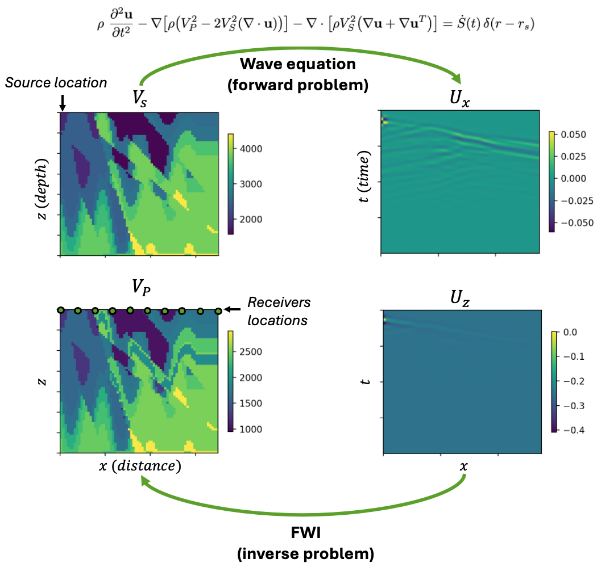
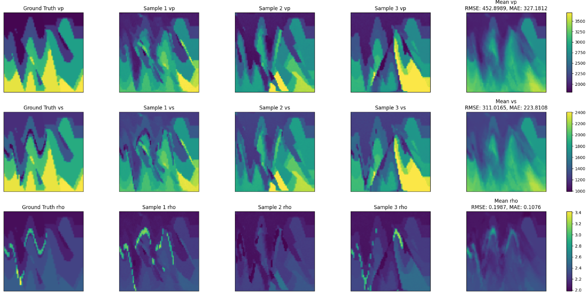
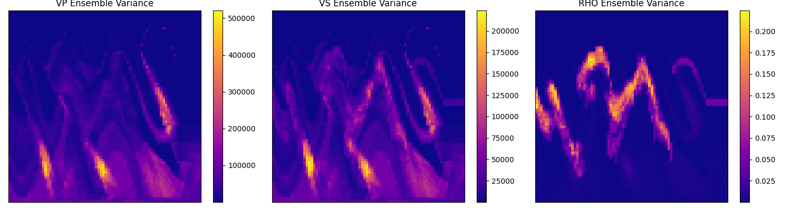
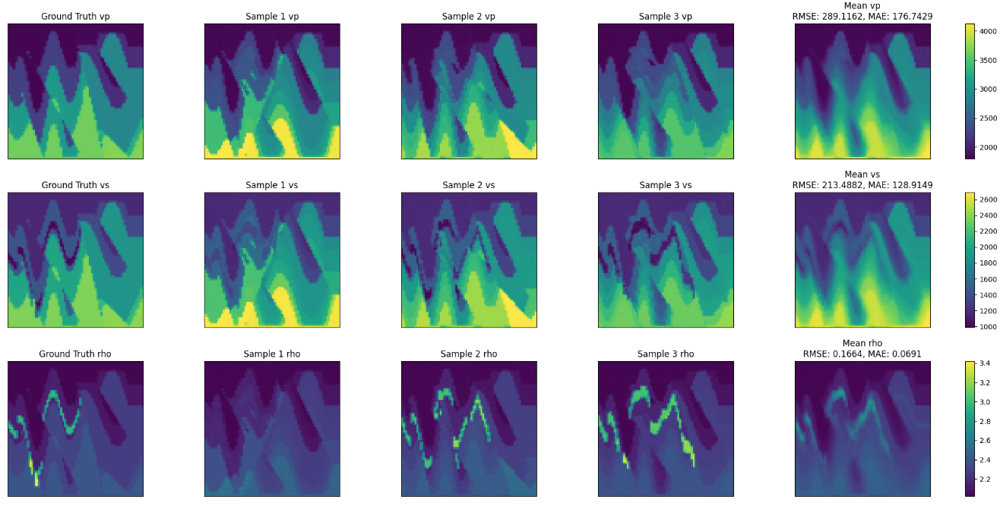

<!-- markdownlint-disable -->
# Diffusion Model for Full-Waveform Inversion (FWI)

## Problem Overview

In the context of geophysics, Full Waveform Inversion (FWI) is a seismic
imaging technique that reconstructs subsurface properties, also called velocity
model, by fitting the recorded seismic waveform. It underpins a range of applications, including:

- Hydro-carbon exploration and production, where an accurate velocity model
  guides drilling decisions.
- CO₂ storage, ensuring the integrity of underground reservoirs used
  for carbon capture and sequestration.
- Global and regional seismology, helping characterise tectonic processes and
  earthquakes.
- Analogous elastic/acoustic imaging modalities such as medical ultrasound and
  non-destructive testing.

The present example is tailored to the elastic wave equation in the context of
hydro-carbon exploration, but the same framework can be applied to other wave
equations and applications.

The following introduces a few key concepts that are essential to FWI in the context of
hydro-carbon exploration:

- *Velocity model* $\mathbf{x}(r)=\bigl[
  V_\mathrm{P},\,V_\mathrm{S},\,\rho \bigr]$ – a 3-D image over
  coordinates $r = (z,x,y)$, where $z$ is the depth, and $x$ and $y$ are the
  surface coordinates. The P-wave velocity is denoted by $V_\mathrm{P}$, the
  S-wave velocity by $V_\mathrm{S}$, and $\rho$ is the density. The velocity
  model spans several kilometres and is discretised at metre-scale resolution.

- *Sources / shots* – positions $r_s = (0, x_s, y_s)_{1 \leq s \leq S}$ where independent
  excitations are fired; typically thousands of shots distributed along the
  surface. The cost associated with acquiring these shots and processing the
  data is a major component of the total cost of the FWI.

- *Receivers* – sensors at locations $r_i = (0, x_i, y_i)_{1 \leq i \leq R}$ that record
  horizontal particle-velocity components $v_x$ and $v_y$ and vertical
  particle-velocity component $v_z$ at the surface. Receivers are typically
  arranged in a 2-D grid of $\mathcal{O}(10^3)$ sensors with a few-meter
  spacing and record data with a time-resolution of a few tenth of seconds.

- *Seismic observations* - the particle-velocity components recorded at all
  receivers for a given shot $s$ can be combined into a 3D image $y_s = [v_z,
  v_x, v_y]$ over coordinates $(t, x_i, y_i)$ that contains reflections,
  refractions and surface waves. The $S$ independent sources can be further
  combined to form a large set $\mathbf{y}$ of 3D observations.

The goal of FWI is to reconstruct the velocity model $\mathbf{x}(r)$ from the
entire set of seismic observations $\mathbf{y}$. To do so, standard FWI uses classical
optimization techniques combined with the elastic wave equation, defined below.



$$
\mathcal{A}_{\mathbf{x}} \{\mathbf{u}\} (r, t) = \dot{S}(t)\,\delta(r-r_s)  \tag{1}
$$
 where $\dot{S}(t)\,\delta(r-r_s)$ is the source at location $r_s$ with time
 signal $\dot{S}(t)$, and $\mathcal{A}_{\mathbf{x}}$ is the elastic wave
 operator defined by:

 $$
\mathcal{A}_{\mathbf{x}} \{\mathbf{u}\} = \rho\ \frac{\partial^{2}
\mathbf{u}}{\partial t^{2}} - \nabla \bigl[  \rho \bigl( V^2_P - 2
V^2_S (\nabla \cdot \mathbf{u})  \bigr) \bigr] - \nabla \cdot \bigl[ \rho
V^2_S \bigl( \nabla \mathbf{u} + \nabla \mathbf{u}^T \bigr) \bigr]
$$

We denote $\mathcal{R} (\mathbf{x}, s)$ the solution operator associated to the
wave equation $(1)$. This operator maps a velocity model $\mathbf{x}$ and a
source $\dot{S}(t)\,\delta(r-r_s)$ to the solution of the PDE at the receiver
locations: it therefore provides a simulated seismic observation $\hat{y}_s$.

FWI seeks to solve an inverse problem of finding the velocity model $\mathbf{x}$
that best fits the observed seismic data $\mathbf{y}$. Given observed data, standard FWI
uses classical optimization techniques to solve the following minimization
problem:

$$
\mathbf{x}^* = \arg \min_{\mathbf{x}} \Phi(\mathbf{x}) = \sum_{s=1}^{S} \bigl\|
\mathcal{R} (\mathbf{x}, s) - y_s \bigr\|_2^{2}
$$

In realistic conditions (limited number of observations, limited resolution,
noise), the inverse problem defined by this equation is ill-posed
(that is, it has multiple solutions). This one-to-many mapping is the main
difficulty of FWI and makes it particularly suitable to be solved with
generative models. This example uses a diffusion model to solve the FWI inverse
problem.

## Prerequisites

This example requires basic knowledge of [denoising diffusion
models](../../generative/README.md); it is also recommended to be familiar with
other examples using diffusion models, such as
[StormCast](../../weather/stormcast/README.md) or
[CorrDiff](../../weather/corrdiff/README.md).

Start by installing PhysicsNeMo (if not already installed) and copying this
folder (`examples/geophysics/diffusion_fwi`) to a system with a GPU available.

Then, install the required dependencies by running below:

```bash
pip install -r requirements.txt
```

or, if you need fine-grained control over the dependencies, you can install them individually:

```bash
pip install hydra-core>=1.2.0 omegaconf>=2.3.0 wandb>=0.13.7 deepwave>=0.0.21
```

Note that the `deepwave` dependency is only necessary for generating the
dataset and for physics-informed sampling.
For data download and processing, it is also required to have `zip` and `unzip`
installed. As those may not be shipped in the currentb physicsnemo container,
you may need to install them manually. For example, on Ubuntu, you can run:

```bash
sudo apt update
sudo apt-get install zip unzip
```

This example comprises a succession of three steps, detailed below:

1. [Dataset preprocessing](#dataset-preprocessing)
2. [Training](#training)
3. [Sampling and model evaluation](#sampling-and-model-evaluation)

## Dataset Preprocessing

This examples builds on the [E-FWI
dataset](https://smileunc.github.io/projects/efwi/datasets), initially
published as [E-FWI: Multi-parameter Benchmark Datasets for Elastic Full
Waveform Inversion of Geophysical
Properties](https://arxiv.org/abs/2306.12386). We complement the original
dataset by providing a data generation pipeline to:

(1) expand the dataset to the case of variable density $\rho(r)$

(2) generate particle-velocity observations from veloicty models in a consistent manner

> **⚠️  Warning:** The E-FWI dataset is distributed under a non-commercial license [CC
> BY-NC-SA 4.0](https://creativecommons.org/licenses/by-nc-sa/4.0/).

### Step 1: Download and Reorganize the E-FWI Dataset

The first step is to download the E-FWI dataset. Because the E-FWI
dataset is composed of multiple sub-datasets (CFB, CFA, FVB), we provide
utility functions to merge them into a single dataset and reorganize the data
into a more convenient format.

To pre-process the entire dataset, navigate to the `./data` directory and run:

```bash
python download_data.py --download --reorganize --clean --shuffle --name all
```

This will download the dataset as a collection of `.npz` files in the directory
`./data/all/samples`. For more information about the possible options, run:

```bash
python download_data.py --help
```

>**Note:** Depending on how many subsets of the E-FWI dataset you want to
>download, the size of the dataset can be quite large (from 100GB to 1TB);
>downloading the full dataset can take several hours.

### Step 2: Generate Seismic Observations

The second step consists in re-generating seismic observations from the
velocity models with variable density.
The original wave speeds $V_\mathrm{P}$ and 
$V_\mathrm{S}$ from the E-FWI datasets are retained and the density is generated
by the `generate_data.py` script. This script then solve an elastic wave
equation using [Deepwave](https://zenodo.org/records/8381177) to generate the
seismic observations. Because this step can be time-consuming, it is advised to
do it on a machine with multiple GPUs. To do so, still in the `./data` directory run:

```bash
python generate_data.py --in_dir ./all --out_dir <path_to_output_directory>
```

This script will generate a new set of `.npz` files in the directory
`<path_to_output_directory>/samples`.

A useful option is to specify the frequency of the source signal, which can be
done by passing the `--source_frequency <frequency>` option to the
`generate_data.py` script. The default frequency is 15 Hz. This value
correspond to the peak frequency of the Ricker wavelet used to generate the
source signal.

### Step 3: Compute Dataset Statistics

For the dataset preprocessing, compute statistics of
the train and test sets by running:

```bash
python compute_stats.py --dir <path_to_output_directory> --batch_size 512 --num_workers 4
```

This script will compute the dataset statistics and save them in the file
`<path_to_output_directory>/stats.json`. It supports distributed processing
based on `torch.distributed`, so it is advised to run it on a machine with
multiple GPUs. If doing so, replace the `python` command with:

```bash
torchrun --standalone --nnodes=<NUM_NODES> --nproc_per_node=<NUM_GPUS_PER_NODE> compute_stats.py --dir <path_to_output_directory> --batch_size 512 --num_workers 4
```

After these steps are completed, verify that you have a dataset ready to be used for
training.

## Training

>**Configuration Basics**
>
>Training is handled by `train.py`, configured using
>[Hydra](https://hydra.cc/docs/intro/) based on the contents of the `config`
>directory. Hydra allows for YAML-based modular and hierarchical configuration
>management and supports command-line overrides for rapid testing and
>experimentation. The `conf/config_train.yaml` file includes the default
>parameters for training a diffusion model for FWI. It contains some fields
>that must be provided by the user at runtime. This can be done by directly
>editing the `conf/config_train.yaml` file (or a copy of it), or by using hydra
>overrides.

To train the model with a specific dataset and set a non-default batch size, one
can run:

```bash
python train.py --config-name=config_train ++dataset.directory=<path_to_dataset_directory> ++training.batch_size_per_device=1024
```

At runtime, Hydra will parse the config subdirectory and command line
overrides into a runtime configuration object `cfg`, which will have all
settings accessible through both attribute or dictionary-like interfaces. For
example, the batch size per device can be accessed either as
`cfg.training.batch_size_per_device` or `cfg['training']['batch_size_per_device']`.

The training script `train.py` will initialize the training experiment and launch
the main training loop.

If running on a machine (single node) with multiple GPUs, the training script can be
parallelized with Distributed Data Parallel (DDP). To do so, run:

```bash
torchrun --standalone --nnodes=1 --nproc_per_node=<NUM_GPUS_PER_NODE> train.py --config-name=config_train ++dataset.directory=<path_to_dataset_directory> ++training.batch_size_per_device=1024
```

To train on multiple nodes or multiple machines, this command needs to be
modified and it is recommended to refer to the [torchrun
documentation](https://docs.pytorch.org/docs/stable/elastic/run.html).

The training script should produce multiple outputs:

- Training logs containing loss values and runtime statistics, either in the console or in the directory `./outputs`

- Checkpoints saved in the directory specified by
  `++io.checkpoint_dir=<path_to_checkpoint_directory>`. This contains the
  trained model checkpoints for inference, as well as checkpoints for resuming
  training.
  
- If required, Weights & Biases logs saved in the directory specified by
  `++wandb.results_dir=<path_to_wandb_directory>`.

## Sampling and Model Evaluation

After training the model, it can be used to generate samples from the learned
distribution $p(\mathbf{x} | \mathbf{y})$ over the velocity model $\mathbf{x}$
and conditioned on the observed seismic data $\mathbf{y}$. This
is handled by the `generate.py` script, which also relies on a hydra-based
configuration in the `conf/config_generate.yaml` file. This example supports
two types of sampling:

- *Zero-shot sampling* - purely data-driven approaches that only uses the
  learned distribution $p(\mathbf{x} | \mathbf{y})$.

- *Physics-informed sampling* - utilizes [Diffusion Posterior Sampling
  (DPS)](https://arxiv.org/abs/2209.14687) with a physics-informed guidance term
  that enforces consistency between the PDE residuals (Eq. 1) and the observed
  data.

### Zero-Shot Sampling

To generate samples from the learned distribution $p(\mathbf{x} | \mathbf{y})$, one
needs to solve the reverse diffusion process defined the following SDE:

$$
d \mathbf{x}_t = \left[ \mathbf{f} (\mathbf{x}_t, t) - g^2 (\mathbf{x}_t, t)
\nabla_{\mathbf{x}_t} \log p_t(\mathbf{x}_t | \mathbf{y}) \right] dt + g
(\mathbf{x}_t, t) d \mathbf{w}_t
$$

In this equation, $t$ is the diffusion time, and $\mathbf{f} (\mathbf{x}_t, t)$
and $g (\mathbf{x}_t, t)$ are the drift and diffusion terms, respectively.
$\nabla_{\mathbf{x}_t} \log p_t(\mathbf{x}_t | \mathbf{y})$ is the conditional
score function previously learned during training, and $\mathbf{w}_t$ is a
standard Wiener process. In this example, we adopt the [EDM
framework](https://arxiv.org/abs/2206.00364) to solve this SDE and generate
clean samples $\mathbf{x}_0$ from noisy latent state
$\mathbf{x}_T$.

The `generate.py` script implements this sampling procedure and supports
ensemble generation. Ensemble generation can be useful for applications such as
uncertainty quantification. To execute the script, one can run:

```bash
python generate.py --config-name=config_generate ++dataset.directory=<path_to_dataset_directory> ++model.checkpoint_path=<path_to_checkpoint> ++generation.sampler.physics_informed=false ++generation.num_ensembles=<size_of_ensemble>
```

The script also supports distributed generation, where the ensemble is split
across multiple devices. To do so, replace the `python` command with:

```bash
torchrun --standalone --nnodes=1 --nproc_per_node=<NUM_GPUS_PER_NODE> generate.py --config-name=config_generate ++dataset.directory=<path_to_dataset_directory> ++model.checkpoint_path=<path_to_checkpoint> ++generation.sampler.physics_informed=false ++generation.num_ensembles=<size_of_ensemble>
```

The script should produce outputs in the directory specified by
`++io.output_dir=<path_to_output_directory>`. There should be one subdirectory
`sample_<index>` for each input sample from the dataset that was processed.
Each subdirectory contains the following:

- A figure `inputs.png` containing the observed seismic data.

- A figure `predictions.png`, as shown below, containing a few predictions from
  the ensemble, as well as the mean prediction and the ground truth velocity
  model.



- A figure `ensemble_variance.png` containing the variance of the ensemble
  predictions. This indiactes the uncertainty on the predicted subsurface
  properties, which is useful for example to guide the placement of potential well logs.



- A subdirectory `numpy` containing the raw numpy arrays of the predictions,
  which can be used for further analysis or post-processing.

If Weights & Biases is enabled, the `generate.py` script also creates a
subdirectory specified by `++wandb.results_dir=<path_to_wandb_directory>`
containing the predictions as Wandb images.

### Physics-informed sampling

The zero-shot sampling procedure is purely data-driven and does not explicitly
use any physics information. This shortcoming can be addressed by using
physics-informed sampling, following the [Diffusion Posterior Sampling
(DPS)](https://arxiv.org/abs/2209.14687) approach. In this approach, the
reverse diffusion SDE is modified to account for a physics-informed guidance
term:

$$
d \mathbf{x}_t = \left[ \mathbf{f} (\mathbf{x}_t, t) - g^2
(\mathbf{x}_t, t) \left( \nabla_{\mathbf{x}_t} \log p_t(\mathbf{x}_t | \mathbf{y})
+ S_c \phi(\mathbf{x}_t, t) \right)\right] dt +
g (\mathbf{x}_t, t) d \mathbf{w}_t
$$

In this equation, $\phi(\mathbf{x}_t, t)$ is the physics-informed guidance
term and $S_c$ is its strength, which can be used to modulate its influence.
The guidance term $\phi(\mathbf{x}_t, t)$ is defined as the likelihood score:

$$
\phi(\mathbf{x}_t, t) = - \nabla_{\mathbf{x}_t} \log p_t(\mathbf{y} |
\mathbf{x}_t) , \textrm{with } \mathbf{y} |
\mathbf{x}_t \sim \mathcal{N} \left( \mathcal{R}( \hat{\mathbf{x}}_0
(\mathbf{x}_t)), \Sigma \right)
$$

where $\mathcal{R}$ is the solution operator associated to the wave equation
(detailed in the [Problem Overview](#problem-overview) section),
$\hat{\mathbf{x}}_0$ is an estimate of the clean velocity model from the
diffusion model, and $\Sigma$ is a parameter related to the measurement noise.
These parameters are defined following an [adapted
version](https://arxiv.org/abs/2506.22780) of the method introduced in
[Score-based data assimilation
(SDA)](https://proceedings.neurips.cc/paper_files/paper/2023/hash/7f7fa581cc8a1970a4332920cdf87395-Abstract-Conference.html).

>**Note:** The present approach is not true DPS, as the latter is usually based
>on an unconditional prior score $\nabla_{\mathbf{x}_t} \log p(\mathbf{x}_t)$,
>trained in an unsupervised manner.
>Instead we use an ad-hoc modification of DPS where we replace the unconditional
>prior score with a conditional score $\nabla_{\mathbf{x}_t} \log p_t(\mathbf{x}_t | \mathbf{y})$,
>trained in a supervised manner.

The `generate.py` script implements this sampling procedure by enabling it in
the `conf/config_generate.yaml` file, or by using the following hydra overrides:

```bash
python generate.py --config-name=config_generate ++dataset.directory=<path_to_dataset_directory> ++model.checkpoint_path=<path_to_checkpoint> ++generation.sampler.physics_informed=true ++generation.num_ensembles=<size_of_ensemble>
```

The guidance parameters can be controlled through the
`++generation.sampler.physics_informed_guidance` field in the configuration.

> **⚠️  Warning:** The default guidance parameters in
> `conf/config_generate.yaml` are only informative and may not be optimal.
> Finding the optimal guidance parameters typically requires some calibration,
> which can be achieved by leveraging hydra capabilities for parameter sweep.

Simlarly to the zero-shot sampling procedure, the `generate.py` script supports
ensemble generation, distributed generation through `torchrun`, Weights &
Biases logging, and it still produces outputs in the directory specified by
`++io.output_dir=<path_to_output_directory>`. For example, the following figure
shows a few predictions from the ensemble, as well as the mean prediction and
the ground truth velocity model.



## References

> **⚠️  Warning:** The E-FWI dataset is distributed under a non-commercial license [CC
> BY-NC-SA 4.0](https://creativecommons.org/licenses/by-nc-sa/4.0/).

- [E-FWI: Multi-parameter Benchmark Datasets for Elastic Full Waveform Inversion of Geophysical Properties](https://arxiv.org/abs/2306.12386)
- [E-FWI datasets](https://smileunc.github.io/projects/efwi/datasets)
- [Deepwave (Richardson A.)](https://zenodo.org/records/8381177)
- [Diffusion Posterior Sampling for General Noisy Inverse Problems](https://arxiv.org/abs/2209.14687)
- [Elucidating the Design Space of Diffusion-Based Generative Models
](https://arxiv.org/abs/2206.00364)
- [Multimodal Atmospheric Super-Resolution With Deep Generative Models
](https://arxiv.org/abs/2506.22780)
- [Score-based data assimilation](https://proceedings.neurips.cc/paper_files/paper/2023/hash/7f7fa581cc8a1970a4332920cdf87395-Abstract-Conference.html)
